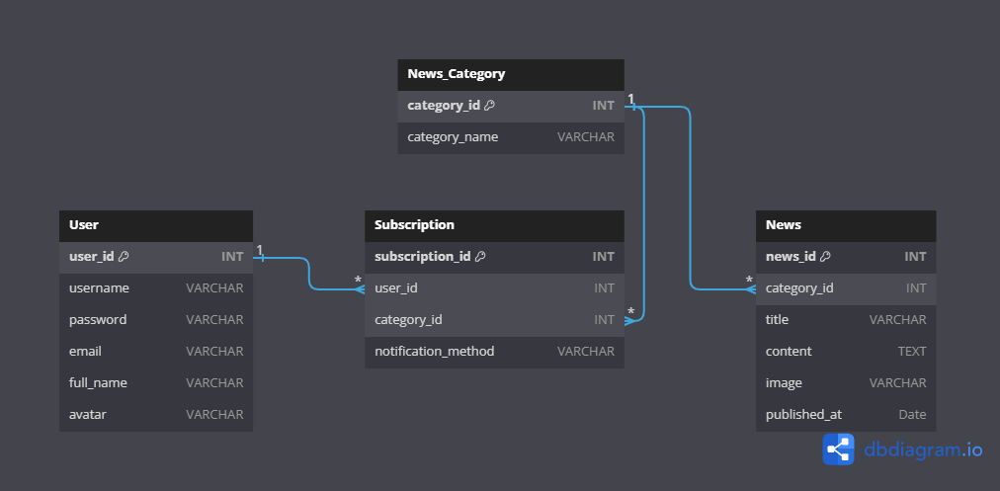

# Site de stiri sportive
> Proiectul consta in realizarea unui site de stiri sportive in care utilizatori isi vor putea crea cont si sa se aboneze pentru a urmari anumite stiri. Acestia vor fi notificati in momentul in care apar noi stiri si isi vor putea gestion profilul. Adminul va fi responsabil pentru a adauga, sterge sau edita postarile.

## Prezentare functionalitati:
### 1. Pagina Principala:

- Pagina principala va oferi o privire generala asupra ultimelor stiri sportive.
- Aceasta va afisa titlurile si scurte rezumate ale articolelor cele mai recente si cele mai populare.

### 2. Pagina de Autentificare si Inregistrare:

- Utilizatorii vor putea sa se autentifice sau sa isi creeze un cont nou pentru a avea acces la toate functionalitatile site-ului.
- Autentificarea si inregistrarea vor fi securizate, asigurand confidentialitatea datelor personale ale utilizatorilor.

### 3. Pagina Profilului Utilizatorului:

- Fiecare utilizator va avea un profil personal unde isi poate gestiona informatiile personale si preferintele de abonare.
- Aceasta pagină va oferi, de asemenea, optiuni pentru a modifica parola, adresa de email si alte setari ale contului.

### 4. Gestionarea Stirilor de catre Admin:

- Adminul site-ului va avea acces la o interfata de administrare dedicata pentru a adauga, edita si sterge articole.
- Va exista, de asemenea, optiuni pentru a incarca imagini și a formata textul articolelor in mod corespunzator.

### 5. Abonare la Stiri:

- Utilizatorii inregistrati vor putea sa se aboneze la diferite categorii de stiri sportive, cum ar fi fotbal, baschet, tenis etc.
- Aceasta optiune de abonare va permite utilizatorilor sa primeasca notificari prin email sau alte metode de comunicare in momentul in care sunt publicate noi articole in categoriile la care sunt abonati.

### 6. Notificari si Abonamente:

- Utilizatorii vor putea sa isi gestioneze abonamentele si preferintele de notificare in cadrul profilului lor.
- Aceasta va include optiuni pentru a activa sau dezactiva notificarile, a modifica frecvența acestora si a alege metoda de livrare preferata (email, notificări pe site etc.).

# Baza de date
## Tabele
### 1. Tabela User :
* __user_id__ _(int, cheie primara, auto-increment)_: Identificator unic pentru fiecare utilizator.
* __username__ _(varchar)_: Numele de utilizator al utilizatorului.
* __password__ _(varchar)_: Parola utilizatorului pentru securitate.
* __email__ _(varchar)_: Adresa de email a utilizatorului.
* __full_name__ _(varchar)_: Numele complet al utilizatorului.
* __avatar__ _(varchar)_: Reprezinta path-ul pana la imagine

### 2. Tabela Categoty :
* __category_id__ _(int, cheie primara, auto-increment)_: Identificator unic pentru fiecare categorie de stiri.
* __category_name__ _(varchar)_: Numele categoriei de stiri (ex: fotbal, baschet, tenis etc.).

### 3. Tabela News :
* __news_id__ _(int, cheie primara, auto-increment)_: Identificator unic pentru fiecare stire.
* __category_id__ _(int, cheie externa)_: Legatura catre categorie.
* __title__ _(varchar)_: Titlul stirii.
* __content__ _(text)_: Continutul stirii.
* __image__ _(varchar)_: Calea catre imaginea asociata stirii.
* __published_at__ _(date)_: Data publicarii stirii.

### 4. Tabela Subscription :
* __subscription_id__ _(int, cheie primara, auto-increment)_: Identificator unic pentru fiecare abonament.
* __user_id__ _(int, cheie externa)_: Legatura catre utilizatorul din tabela Utilizatori.
* __category_id__ _(int, cheie externa)_: Legatura catre categoria din tabela Categorii stiri.
* __notification_method__ _(bool)_: Metoda de notificare dorita (email sau deloc).

## Relatii
### 1. Tabela User si Tabela Subscription :
- relatia este de tipul __"one-to-many"__, deoarece un utilizator poate avea mai multe abonamente, dar un abonament apartine doar unui utilizator.
- aceasta relatie este realizata prin intermediul campului __'user_id'__ din tabela __'Subscription'__, care este o cheie externa ce face referire la campul user_id din tabela __'User'__.
#### 2. Tabela Category si Tabela News : 
- relatia este de tipul __"one-to-many"__, deoarece o categorie de stiri poate contine mai multe stiri, dar o stire apartine doar unei categorii.
- aceasta relatie este realizata prin intermediul campului __'category_id'__ din tabela __'News'__, care este o cheie externa ce face referire la campul __'category_id'__ din tabela __'Category'__.
### 3. Tabela Category si Tabela Subscription :
- relatia este de tipul __"many-to-many"__, deoarece o categorie poate apartine mai multor abonamente, iar un abonament poate fi asociat cu mai multe categorii.
- aceasta relatie este intermediata de tabela de asociere __'Subscription'__, care contine cheile externe __'user_id'__ si __'category_id'__ pentru a face legatura intre utilizatori si categoriile de stiri la care sunt abonate.

